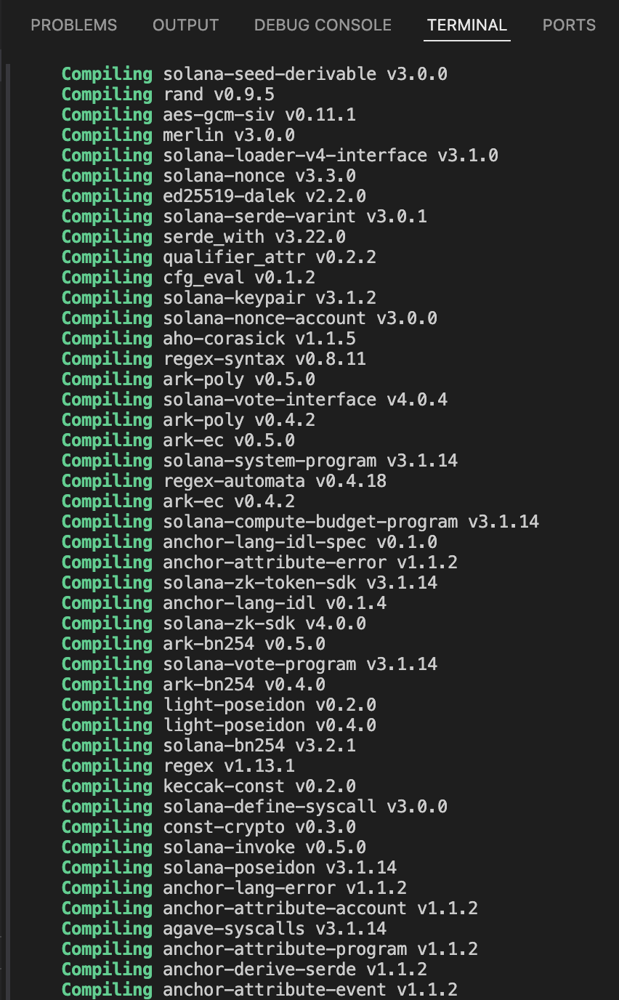

# Solana Task 2 — Vault & Escrow Programs

Two Anchor programs built for Week 2's assignment: a lamport vault (deposit/withdraw/close) and a Token-2022 escrow (make/take/refund/update). Both are tested end-to-end with [LiteSVM](https://github.com/LiteSVM/litesvm).

- **Anchor version:** `1.1.2` (a fork published under `otter-sec/anchor` on crates.io — this matters, see [Non-standard Anchor fork](#non-standard-anchor-fork) below)
- **Workspace:** `anchor_vault_starter_q3_26`
  - `programs/q3_26_vault` — the vault program
  - `programs/escrow` — the escrow program

---

## Table of Contents

1. [What the assignment covers](#what-the-assignment-covers)
2. [Vault program](#vault-program)
3. [Escrow program](#escrow-program)
4. [Test coverage](#test-coverage)
5. [Non-standard Anchor fork](#non-standard-anchor-fork)
6. [Every bug fixed, in order](#every-bug-fixed-in-order)
7. [How to build and test](#how-to-build-and-test)
8. [Known gaps / suggested next steps](#known-gaps--suggested-next-steps)

---

## What the assignment covers

| Task | Requirement | Status |
|---|---|---|
| 1 | Write the vault program including `withdraw` and `close` | ✅ Done |
| 2 | Write the escrow program with `make`, `take`, `refund`, `update` | ✅ Done |
| 3 | Write tests covering all instructions (TypeScript or Rust/LiteSVM) | ✅ Done — Rust + LiteSVM |

---

## Vault program

`programs/q3_26_vault/src/`

A simple per-user lamport vault. Each user gets one `VaultState` account and one vault `SystemAccount`, both PDAs derived from the user's pubkey.

| File | Purpose |
|---|---|
| `state.rs` | `VaultState { vault_bump, state_bump }` |
| `constants.rs` | `VAULT_SEED = b"vault"`, `STATE = b"state"` |
| `error.rs` | `InvalidAmount`, `InsufficientVaultBalance` |
| `instructions/initialize.rs` | Creates `vault_state` PDA + a rent-exempt vault PDA (pre-existing) |
| `instructions/deposit.rs` | Transfers lamports from user → vault (pre-existing) |
| `instructions/withdraw.rs` | Transfers lamports from vault → user, signed by the vault PDA's seeds. Guards against dropping the vault below its rent-exempt minimum. **(new)** |
| `instructions/close.rs` | Drains the vault to zero and closes `vault_state`, refunding rent to the user. **(new)** |

### Instruction flow

```
initialize → deposit → withdraw → close
```

`initialize` and `deposit` already existed in the starter repo. `withdraw` and `close` were written for this assignment.

### Design notes

- The vault itself is a plain `SystemAccount`, not an Anchor `#[account]` — it holds no data, just lamports. Because of that it has no `close` constraint available; `close.rs` manually sweeps its full balance out via a signed `system_program::transfer` CPI before the instruction returns.
- `vault_state` *is* an Anchor account, so it uses `close = user` to auto-close and refund rent.
- `withdraw` checks `vault_balance.saturating_sub(amount) >= rent_exempt` before transferring, so a withdrawal can never leave the vault under its rent-exempt minimum (which would make it disappear from the validator's rent-collection sweep).

---

## Escrow program

`programs/escrow/src/`

A two-party token swap using Token-2022 (`token_2022` feature of `anchor-spl`). The maker deposits token A into a vault (an ATA owned by the escrow PDA) and specifies how much token B they want in return. A taker can fulfill the trade, or the maker can refund/update it before anyone does.

| File | Purpose |
|---|---|
| `state.rs` | `Escrow { seed, maker, mint_a, mint_b, receive, bump }` |
| `constants.rs` | `ESCROW_SEED = b"escrow"` |
| `error.rs` | `InvalidAmount` |
| `instructions/make.rs` | Maker creates the escrow PDA + vault ATA, deposits `mint_a` |
| `instructions/take.rs` | Taker sends `mint_b` to maker, receives `mint_a` from vault; escrow + vault close |
| `instructions/refund.rs` | Maker reclaims `mint_a` from vault; escrow + vault close |
| `instructions/update.rs` | Maker changes the `receive` amount on an open escrow |

### Why a `seed` field?

The `Escrow` PDA is derived from `[ESCROW_SEED, maker, seed.to_le_bytes()]`. Without the `seed`, one maker could only ever have a single open escrow at a time (the PDA would collide). The `seed` is a caller-supplied `u64` that lets the same maker run multiple simultaneous escrows.

### Why `Box<...>` on several account types?

`take.rs` originally failed to compile for the **BPF/SBF release target** (not the test build) with:

```
Function ...Take...try_accounts... Stack offset of 4448 exceeded max offset of 4096 by 352 bytes
```

`InterfaceAccount<'info, Mint/TokenAccount>` types are larger on the stack than their classic SPL-Token equivalents, and `Take` has nine accounts. Wrapping every `InterfaceAccount`/`Account` field in `Box<...>` moves the deserialized struct onto the heap, which brought the stack frame back under Solana's 4096-byte limit without changing any validation logic (Anchor's `#[derive(Accounts)]` handles `Box<T>` transparently, and `Deref` means `self.vault.amount` etc. still work unmodified).

### `init_if_needed`

`taker_ata_a` (in `take.rs`) and `maker_ata_b` (in `take.rs`) use `init_if_needed`, because the taker may not already hold an ATA for `mint_a`, and the maker may not already hold one for `mint_b`. This requires the `init-if-needed` feature flag on `anchor-lang` in `Cargo.toml`. It's safe here specifically because the accounts being conditionally initialized are plain token accounts with no program-defined state that a re-initialization attack could exploit.

### Instruction flow

```
        ┌──> take   (escrow + vault close, funds swap)
make ───┤
        ├──> refund (escrow + vault close, maker gets mint_a back)
        │
        └──> update (receive amount changes, escrow stays open)
```

---

## Test coverage

Both test suites use [LiteSVM](https://github.com/LiteSVM/litesvm) (an in-process Solana VM) rather than a local validator, driven by hand-built `Instruction`s and `anchor_lang`'s `InstructionData`/`ToAccountMetas` traits — no TypeScript, no `solana-test-validator`.

### `programs/q3_26_vault/tests/test_initialize.rs`

One end-to-end test walking through all four vault instructions on a single user:

1. `initialize` → asserts `vault_state` exists and the vault is rent-exempt
2. `deposit` → asserts the vault balance increased by the deposit
3. `withdraw` → asserts the vault balance decreased by the withdrawal
4. `close` → asserts `vault_state` is gone and the vault balance is `0`

### `programs/escrow/tests/test_escrow.rs`

Four independent tests, each spinning up its own `LiteSVM` instance via a shared `setup()` helper:

| Test | Covers |
|---|---|
| `test_make` | Escrow PDA and vault ATA are created after `make` |
| `test_take` | Full swap: taker gets `mint_a`, maker gets `mint_b`, escrow + vault close |
| `test_refund` | Maker gets `mint_a` back, escrow + vault close |
| `test_update` | `receive` field changes on an otherwise-untouched, still-open escrow |

Shared helpers:
- `send` / `send_multi` — build a `Message`, wrap it in a `VersionedTransaction`, submit it, and panic with the transaction logs on failure (so test failures are debuggable instead of opaque).
- `create_mint_and_fund` — creates a Token-2022 mint, creates an ATA for a given owner, and mints an initial balance into it. Used for both `mint_a` and `mint_b` in every test.
- `setup` — loads the compiled `escrow.so`, creates `maker`/`taker`/`mint_authority` keypairs, and airdrops SOL to each.

### A note on assertion style

`test_take`, `test_refund`, and `test_update` read raw account bytes directly (e.g. `u64::from_le_bytes(data[64..72]...)` for a Token-2022 token amount, or a hand-computed byte offset for the `Escrow.receive` field) instead of using a deserialization helper function. This was a deliberate choice: given how much of this session was spent chasing this Anchor fork's non-standard API surface (see below), reading raw bytes against a known, stable account layout was more reliable than gambling on another helper function existing where expected. Byte offset 64 for the token amount is stable across both classic SPL Token and Token-2022 (extensions are appended *after* the base 165-byte layout).

---

## Non-standard Anchor fork

This project pins `anchor-lang = "1.1.2"` and `anchor-spl = "1.1.2"`, which resolve to a fork published at `github.com/otter-sec/anchor` — **not** the mainline `coral-xyz/anchor` or `solana-foundation/anchor` repos. This fork behaves differently from "textbook" Anchor in ways that caused several of the bugs below:

- `CpiContext::new(program, accounts)` and `CpiContext::new_with_signer(...)` expect the **program's `Pubkey`**, not its `AccountInfo`. Mainline Anchor (post-`CpiContext` redesign) expects `AccountInfo`. Every CPI call in this codebase uses `.key()`, not `.to_account_info()`, for the program argument.
- `anchor-spl`'s `token_2022`/`associated_token` features pull in the newer, modular **`spl-*-interface`** crate family (`spl-token-2022-interface`, `spl-associated-token-account-interface`) rather than the older monolithic `spl-token-2022`/`spl-associated-token-account` crates. Mixing the two families in the same dependency graph causes duplicate, structurally-identical-but-type-distinct `Pubkey`/`Instruction` types (a classic "two versions of the same crate" Cargo error). The fix was to stop pulling `spl-token-2022`/`spl-associated-token-account` as separate dev-dependencies entirely and use `anchor_spl`'s own re-exports (`anchor_spl::token_interface::spl_token_2022::*`, `anchor_spl::associated_token::spl_associated_token_account::*`), since those are guaranteed to be version-aligned with everything else `anchor_spl` already pulls in.

If you're extending this project and something's API doesn't match what you'd expect from Anchor tutorials or documentation online, check here first — it's very likely a fork difference, not a mistake.

---

## Every bug fixed, in order

This section is a full changelog of every compile error, dependency conflict, and logic bug hit while building this out, in the order they were found. Each one includes the root cause and the fix, in case a future assignment based on this same starter hits the same wall.

### 1. `CpiContext::new` expected `Pubkey`, not `AccountInfo`

**Where:** `deposit.rs`, `initialize.rs`, then later `withdraw.rs`, `make.rs`, `take.rs`, `refund.rs`.

**Symptom:**
```
error[E0308]: mismatched types
expected `Pubkey`, found `AccountInfo<'_>`
```

**Root cause:** This `anchor-lang` fork's `CpiContext::new`/`new_with_signer` signature takes the CPI target program as a `Pubkey`, unlike the mainline Anchor API most tutorials assume (`AccountInfo`). This was initially guessed backwards — an early draft of `withdraw.rs` used `.to_account_info()` "to fix" what was actually already-correct code in `deposit.rs`, which broke the build.

**Fix:** Always call `.key()` (not `.to_account_info()`) on the program account when constructing a `CpiContext` in this codebase, e.g.:
```rust
let cpi_program = self.system_program.key(); // not .to_account_info()
let cpi_ctx = CpiContext::new(cpi_program, cpi_accounts);
```

---

### 2. Program ID mismatch after `anchor new`

**Symptom:**
```
Program ID mismatch detected for program 'q3_26_vault':
  Keypair file has: AMB9GgRgrKPxJDFLBcsGBTVbsMZjZjcDg3cAT9NxEw7H
  Source code has:  aNksHVU3gU1mjCPtTBsVk9S7qokAUvXfotB2jBxQQvv
```

**Root cause:** The `declare_id!` in `lib.rs` and the ID in `Anchor.toml` didn't match the actual program keypair generated on disk (`target/deploy/*.json`) — normal when a repo is cloned/shared and the deploy keypair regenerates locally.

**Fix:**
```
anchor keys sync
```
This updates both `lib.rs`'s `declare_id!` and `Anchor.toml` to match the local keypair.

---

### 3. Leftover `anchor new` boilerplate in the escrow program

**Symptom:**
```
error[E0432]: unresolved import `crate::state::Counter`
error[E0425]: cannot find value `COUNTER_SEED` in this scope
error[E0603]: enum import `ErrorCode` is private
```

**Root cause:** `anchor new escrow` scaffolds a default counter example (`initialize.rs` / `increment.rs` referencing a `Counter` account that was never created), since no custom template was specified.

**Fix:** Deleted the generated `instructions/initialize.rs` and `instructions/increment.rs`, and rewrote `lib.rs` / `instructions.rs` from scratch with the real instruction set (`make`, `take`, `refund`, `update`).

---

### 4. `init_if_needed` requires an explicit feature flag

**Where:** `take.rs` (`taker_ata_a`, `maker_ata_b`)

**Symptom:**
```
error: init_if_needed requires that anchor-lang be imported with the
init-if-needed cargo feature enabled.
```
(cascaded into a wall of unrelated-looking `Bumps`/`Accounts` trait errors, because the `#[derive(Accounts)]` macro failed to expand at all)

**Root cause:** `init_if_needed` is gated behind a Cargo feature by design, since misusing it (re-initializing an account that holds meaningful program state) can enable a re-initialization attack.

**Fix:** Added the feature flag:
```toml
anchor-lang = { version = "1.1.2", features = ["init-if-needed"] }
```
Confirmed this specific use is safe: the accounts involved are plain ATAs with no custom program state, so there's nothing for a re-init attack to exploit.

---

### 5. BPF stack size exceeded in `take.rs`

**Symptom:**
```
Error: Function ...Take...try_accounts... Stack offset of 4448 exceeded
max offset of 4096 by 352 bytes
```

**Root cause:** `Take` has nine accounts, several of them `InterfaceAccount<'info, Mint/TokenAccount>` — larger on the stack than classic SPL-Token equivalents. Together they exceeded Solana's 4096-byte stack frame limit for BPF/SBF programs. Notably, this only appeared during the actual on-chain (release/BPF) compile step, not the `test` profile build — so it's easy to miss if you only check `cargo build --tests`.

**Fix:** Wrapped every `InterfaceAccount<'info, T>` and `Account<'info, Escrow>` field in `Take` (and, preemptively, `Refund`) in `Box<...>`, moving them to the heap. No constraint or validation logic changed — `Box<T>` derefs transparently.

---

### 6. Dependency graph collision: two incompatible `Pubkey`/`Instruction` types

**Symptom (abbreviated):**
```
error[E0308]: mismatched types
expected `&Address`, found `&__Pubkey`
...
note: two different versions of crate `solana_instruction` are being used
```

**Root cause:** Adding `spl-token-2022 = "9.0.0"` and `spl-associated-token-account = "6.0.0"` as separate dev-dependencies pulled in their own transitive `solana-*` crate versions, which didn't match the versions `anchor-spl` (already a normal dependency) resolves to internally. Cargo allows two semver-incompatible versions of the same crate to coexist in one build, but their types are then distinct even if structurally identical — hence `Pubkey` from one graph not matching `Pubkey` from the other.

**Investigation:** Ran `cargo doc -p anchor-spl --no-deps --open` and inspected the locally-cached source (`~/.cargo/registry/src/.../anchor-spl-1.1.2/src/associated_token.rs`) directly, rather than guessing at undocumented re-export paths a third time.

**Fix:** Removed `spl-token-2022` and `spl-associated-token-account` from `[dev-dependencies]` entirely. Used `anchor_spl`'s own re-exports instead, which are guaranteed version-aligned with the rest of the build:
```rust
use anchor_spl::{
    associated_token::{
        get_associated_token_address_with_program_id,
        spl_associated_token_account::instruction::create_associated_token_account,
    },
    token_interface::spl_token_2022::{
        self,
        instruction::{initialize_mint2, mint_to},
        state::Mint as SplMint,
    },
};
```

---

### 7. Missing `Pack` trait for `Mint::LEN`

**Symptom:**
```
error[E0599]: no associated item named `LEN` found for struct
`anchor_spl::token_2022::spl_token_2022_interface::state::Mint`
help: trait `Pack` which provides `LEN` is implemented but not in scope
```

**Root cause:** `LEN` is an associated constant provided by the `Pack` trait, not an inherent member of `Mint` — it has to be explicitly imported even though only the constant (not any trait method) was being used.

**First attempt failed too:** the compiler's own suggested import path, `anchor_lang::solana_program::solana_program_pack::Pack`, doesn't actually exist in this fork (`error[E0432]: unresolved import`). The trait lives in the separate `solana-program-pack` crate, which was already in the dependency tree transitively but not exposed at that path.

**Fix:** Added `solana-program-pack = "3.1.0"` directly as a dev-dependency, and imported it as its own crate:
```rust
use solana_program_pack::Pack;
```

---

### 8. `mint_b` required to be a real, initialized account

**Symptom:**
```
AnchorError caused by account: mint_b. Error Code: AccountNotInitialized.
```

**Root cause:** `Make`'s accounts struct types `mint_b` as `InterfaceAccount<'info, Mint>`, so Anchor deserializes and validates it as a real mint on-chain — regardless of whether `make`'s instruction logic actually reads from it. Passing an arbitrary, uninitialized `Pubkey` (as the first draft of `test_make` did) fails validation before the handler even runs.

**Fix:** Used the existing `create_mint_and_fund` helper to create a real `mint_b` in every test that calls `make` — funding it to the taker (for `test_make`/`test_take`) or the maker with a zero amount (for `test_refund`/`test_update`, where `mint_b` just needs to exist, not hold a balance).

---

## How to build and test

```bash
# Sync program IDs if you've just cloned this repo (keypairs regenerate locally)
anchor keys sync

# Build both programs (compiles for both the BPF/release target and the test profile)
anchor build

# Run every test in the workspace
cargo test --workspace

# Run just one program's tests
cargo test -p q3_26_vault
cargo test -p escrow

# Run a single test with full logs on failure
cargo test -p escrow test_take -- --nocapture
```

Expected final state: **7 tests passing** across both programs (2 `test_id` sanity tests generated by Anchor, 1 full vault lifecycle test, 4 escrow instruction tests).

---

## Screenshots




